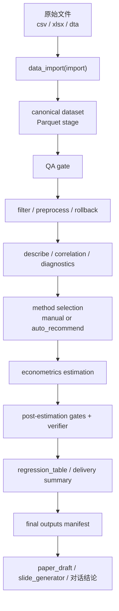
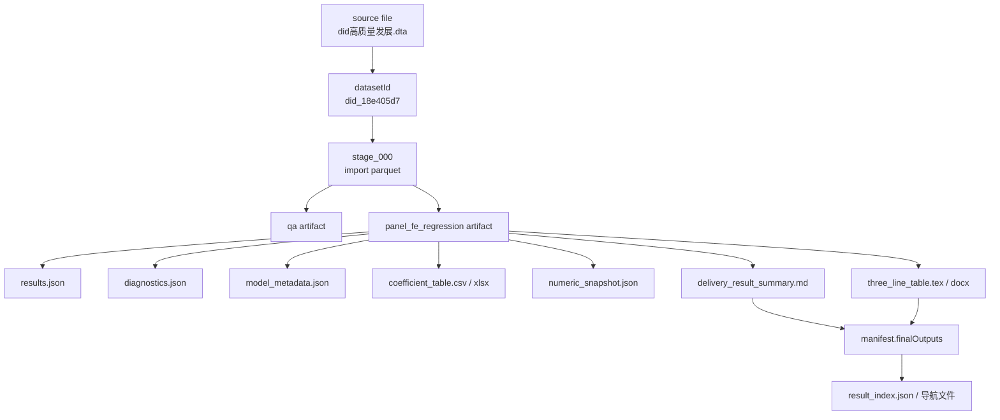
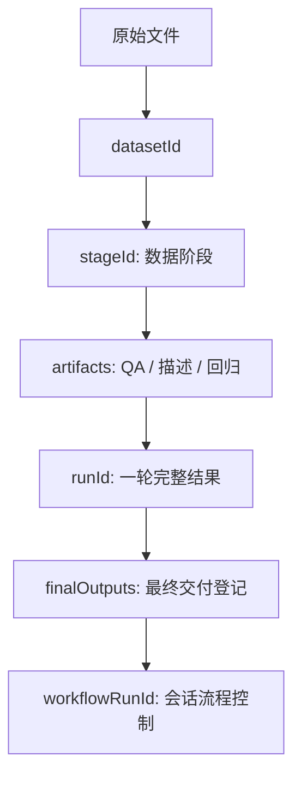

# Killstata 当前实装全链路梳理

这份文档只讲一个口径:

`当前代码里已经真实存在、并且能从源码和落盘产物里对得上的链路。`

不把未来规划、产品脑暴、尚未完全落地的理想态混进来。

---

## 1. 一句话总览

`killstata` 不是那种:

`读一个表 -> 直接回归 -> 聊天框口头报结果`

的直线脚本。

它更像一个带状态管理的实证分析流水线:

1. 先把原始数据导入成可追踪的 canonical dataset artifact
2. 再围绕 `datasetId / stageId / runId / workflowRunId` 推进各阶段
3. 每一阶段保存结构化产物
4. 最后再把结果整理成用户可读、可交付、可复核的输出

最稳的脑图可以记成:

`原始表 -> import 成 parquet canonical stage -> qa -> filter/preprocess 派生新 stage -> describe/diagnostics -> econometrics 基于 stage 估计 -> verifier 校验 -> regression_table / delivery summary -> finalOutputs 登记 -> paper/slides/对话结论`

---

## 2. 主链路图



如果你更喜欢“代码执行视角”，它其实是下面这个顺序:


---

## 3. 这套系统真正围绕什么在转

### 3.1 不是围绕原始文件路径

用户一开始提供的当然是文件路径，比如:

- `.csv`
- `.xlsx`
- `.dta`

但从 `import` 结束的那一刻开始，后续主流程就不应该继续“直接拿原始 Excel 或 DTA 硬读硬跑”。

系统真正围绕的是下面四个 ID:

- `datasetId`
- `stageId`
- `runId`
- `workflowRunId`

它们分别回答四个问题:

- `datasetId`: 这是哪一份数据资产
- `stageId`: 这是这份数据资产的哪一个处理阶段
- `runId`: 这是哪一轮完整分析输出
- `workflowRunId`: 这是当前会话的流程状态机实例

所以 killstata 的核心对象，其实不是“那个 dta 文件”，而是:

`一个可追踪的数据实体 + 这个实体在不同 stage 上派生出来的分析产物`

---

## 4. 四个核心 ID 到底分别干嘛

### 4.1 `datasetId`

这是同一个原始数据文件进入 killstata 后，被系统登记成的“项目级数据实体 ID”。

它的主要职责:

- 绑定源文件
- 维护 manifest
- 串起所有 stages
- 串起所有 artifacts
- 串起最终 final outputs

典型落盘位置:

```text
.killstata/datasets/<datasetId>/manifest.json
```

比如仓库里真实跑过的样例:

```text
datasetId = did_18e405d7
```

### 4.2 `stageId`

这是数据工作阶段 ID。

最典型的第一个 stage 是:

```text
stage_000
```

通常它对应导入后的 canonical parquet 数据。

后面如果执行:

- `filter`
- `preprocess`
- `rollback`

就会继续生成新的 stage 或 stage 版本，而不是覆盖原来的数据。

它的意义很像:

`数据处理过程中的 commit`

优点很大:

- 原始导入态还在
- 清洗态另存
- 可以追踪 parentStageId
- 可以复盘“哪一步把数据改成现在这样”

### 4.3 `runId`

`runId` 不是数据实体 ID，而是一次完整分析运行的输出分组 ID。

它主要负责把同一轮分析的各种结果捆在一起，比如:

- 回归结果
- 三线表
- delivery summary
- result_index
- final outputs

所以如果你把 `datasetId` 理解成“数据身份证”，那 `runId` 更像“这次实证任务的任务单号”。

### 4.4 `workflowRunId`

这个 ID 更偏 runtime。

它描述的是:

`当前聊天会话里，这条 workflow 状态机现在跑到哪、卡在哪、该修哪一关`

它不直接代表数据，也不直接代表产物，而是代表“流程控制实例”。

它通常关心的是:

- 当前 active stage 是什么
- 哪个 stage failed
- 是否进入 repair-only
- 是否已通过 verifier

---

## 5. Import 阶段: 从原始文件到 canonical dataset

### 5.1 Import 是真正入口

killstata 在当前实装里，真正的分析入口是 `data_import(action="import")`。

它的职责不是简单“把文件读进来”，而是把原始表转成:

- 内部工作层: `Parquet`
- 检查层: `CSV / XLSX`
- 元数据层: `schema / labels / summary / log`

也就是说，导入这一步已经开始做“分析可复现”的基础设施建设了。

### 5.2 为什么内部工作层是 Parquet

当前代码对 internal working layer 的政策非常明确:

- input layer: Excel / CSV / DTA
- internal working layer: Parquet + metadata sidecar
- user inspection/export layer: CSV / XLSX
- compatibility export layer: DTA

这意味着:

- 用户继续看人类友好的表格
- 系统内部使用更稳定的 Parquet 作为 canonical stage

### 5.3 Import 结束后会生成什么

当前代码会同时生成一套完整基础资产。典型包括:

- parquet stage
- schema JSON
- labels JSON
- summary JSON
- audit log
- inspection CSV
- inspection XLSX

典型目录结构像这样:

```text
.killstata/
  datasets/
    <datasetId>/
      manifest.json
      stages/
      inspection/
      meta/
      audit/
      reports/
```

真实样例里，`did_18e405d7` 的导入结果就落在:

```text
.killstata/datasets/did_18e405d7/stages/stage_000_import_*.parquet
.killstata/datasets/did_18e405d7/inspection/stage_000_import_*.csv
.killstata/datasets/did_18e405d7/inspection/stage_000_import_*.xlsx
.killstata/datasets/did_18e405d7/meta/stage_000_import_*_schema.json
.killstata/datasets/did_18e405d7/meta/stage_000_import_*_labels.json
.killstata/datasets/did_18e405d7/audit/stage_000_import_*_summary.json
.killstata/datasets/did_18e405d7/audit/stage_000_import_*_log.md
```

---

## 6. Manifest: 真正的数据真相源

导入完成后，系统会创建:

```text
.killstata/datasets/<datasetId>/manifest.json
```

这个 manifest 是理解 killstata 的关键。

它维护三种记录:

### 6.1 `stages`

这些是会改变工作数据本体的阶段。

比如:

- import
- filter
- preprocess
- rollback

这些动作的共同点是:

`会产出一个新的 parquet working dataset`

### 6.2 `artifacts`

这些动作不直接改工作数据本体，但会产出分析结果。

比如:

- qa
- describe
- correlation
- panel_fe_regression
- auto_recommend
- smart_baseline

这些更像“基于某个 stage 做分析并生成报告”。

### 6.3 `finalOutputs`

这个层级才是最贴近用户交付的东西。

比如:

- `回归结果_xxx.md`
- `三线表_xxx.tex`
- `三线表_xxx.docx`
- `paper_draft.md`
- `slides.json`

也就是说，`manifest` 不是只记录“数据在哪”，它记录的是:

`这份数据从进入系统开始，到最后交付给用户，中间所有关键状态和关键产物`

---

## 7. 为什么后续必须优先用 `datasetId / stageId`

这是当前 killstata 最重要的设计原则之一。

一旦 canonical dataset 建立，后续分析的标准姿势就应该是:

- 用 `datasetId`
- 用 `stageId`
- 从对应 stage 的 parquet 去继续

而不是反复直接回到最初的 `.xlsx` 或 `.dta`。

原因很简单:

1. 原始文件不记录后续处理状态
2. stage 才能表达“清洗到哪一步了”
3. artifact 才能表达“这个数字到底来自哪一轮结果”

read 工具本身都明确限制:

- 不允许把 canonical parquet stage 当文本读
- 推荐改用 `data_import / econometrics`
- 或读取结构化 artifact 如 `results.json / diagnostics.json / numeric_snapshot.json`

这其实就是在强制执行一套流程纪律:

`不要围绕原始文件瞎跑，要围绕已保存的 artifact 工作`

---

## 8. QA 阶段: 硬闸门，不是礼貌性提示

### 8.1 QA 检查什么

`data_import(action="qa")` 当前会检查:

- 缺失情况
- duplicate panel keys
- 数值可用性
- 异常值提示
- 面板平衡信号

如果提供 `entityVar / timeVar`，它就更能按 panel 结构来检查。

### 8.2 QA 结果分三档

- `pass`
- `warn`
- `block`

对应的实际含义是:

- `pass`: 可以继续
- `warn`: 可以继续，但要带风险披露
- `block`: 不能进入估计，必须先修

### 8.3 QA 为什么是链路中心

这一步非常重要，因为 killstata 的真实执行哲学不是:

`导入 -> 立刻回归`

而是:

`导入 -> QA -> 修/筛/清 -> 再估计`

---

## 9. Filter / Preprocess / Rollback: 数据 stage 的派生层

### 9.1 这些操作会真正生成新 stage

当前代码里:

- `filter`
- `preprocess`
- `rollback`

都属于 stage-producing actions。

也就是说，它们会生成新的 working parquet，而不是在原 stage 上“直接改文件”。

### 9.2 这有什么好处

好处非常大:

- 你能保留原始导入态
- 你能保留清洗态
- 你能比较两个 stage 的差异
- 你能把失败归因到某一个 stage
- 你能回滚，而不是只能重来

一句人话:

`它让数据处理过程留下脚印。`

### 9.3 这些操作通常会顺带产出什么

除了新的 parquet stage，本阶段常见还会附带:

- inspection CSV/XLSX
- summary JSON
- audit log
- 有时还会发布 delivery workbook

---

## 10. Describe / Correlation: artifact 层，不改数据本体

### 10.1 它们不产出新 parquet 主体

`describe` 和 `correlation` 当前属于 artifact 层。

也就是说:

- 它们读取已有 stage
- 生成结果表
- 但不改 stage 本身

### 10.2 它们会生成什么

当前代码里通常会生成:

- CSV
- XLSX
- summary JSON
- `numeric_snapshot.json`

### 10.3 `numeric_snapshot.json` 为什么这么重要

这是 killstata 当前 grounding 设计里的关键角色。

它的任务是:

`把真正可引用的数值，结构化保存下来`

后面 agent 在对话里要报:

- 系数
- p 值
- 标准误
- N
- R²

这些数字时，理想做法不是“模型记住了”，而是“从 numeric snapshot 或结构化结果里读到并引用”。

---

## 11. 方法选择: 显式指定 和 智能推荐 两条路

### 11.1 显式指定

最直接的路径就是用户明确要求:

- `panel_fe_regression`
- `ols_regression`
- `did_static`
- `iv_2sls`
- `psm_double_robust`
- `rdd` 类方法

这时候 `econometrics` 直接根据 `methodName` 执行。

### 11.2 `auto_recommend`

这个方法的角色更像“画像和建议层”。

它会结合数据结构做推荐，比如:

- 是 cross-section 还是 panel
- 是否存在 entity / time 结构
- treatment 变量像不像 did 指示变量
- 有没有 instrument-like 变量

然后给出:

- recommendedMethod
- covariance strategy
- confidence
- reasons
- warnings
- nextBestMethods

### 11.3 `smart_baseline`

这个更像“推荐后自动找一个当前可执行 baseline”。

它的关键价值在于:

- 不只是推荐
- 还会看当前条件够不够执行
- 如果不够，会自动降级成能跑的 baseline

例如:

- 推荐了 `panel_fe_regression`，但 `entityVar / timeVar` 不完整
- 那就可能退回 `ols_regression`

---

## 12. Econometrics 阶段: 真正的实证估计

### 12.1 输入优先级

当前设计里，估计阶段最推荐的输入方式是:

- `datasetId`
- `stageId`

然后系统再去找到对应 stage 的 parquet working dataset。

### 12.2 面板 FE 的要求

如果方法是 `panel_fe_regression`，通常会要求:

- `dependentVar`
- `treatmentVar`
- `entityVar`
- `timeVar`

有时还会结合:

- `clusterVar`
- `covariates`

### 12.3 结果不是一个系数，而是一整个结果目录

当前 `econometrics` 跑完后，通常不会只返回一句:

`coef = 0.03`

而是会写出一整个结果目录，常见文件包括:

- `results.json`
- `diagnostics.json`
- `model_metadata.json`
- `coefficient_table.csv`
- `coefficient_table.xlsx`
- `narrative.md`
- `numeric_snapshot.json`
- `three_line_table.tex`
- `three_line_table.docx`
- `delivery_result_summary.md`

---

## 13. 结果目录里每个文件分别负责什么

### 13.1 `results.json`

这是模型主结果。

通常负责记录:

- success
- method
- coefficient
- std_error
- p_value
- r_squared
- rows_used
- output_path
- diagnostics_path
- metadata_path
- narrative_path
- effective_method
- effective_covariance
- degraded_from
- run_id

### 13.2 `diagnostics.json`

这是诊断层。

通常包括:

- panel 结构信息
- cluster count
- duplicate entity-time rows
- residual stats
- qa warnings / blocking errors
- post_estimation_gates

### 13.3 `model_metadata.json`

这是规格层。

它更偏“模型是怎么设的”。

### 13.4 `coefficient_table.csv / .xlsx`

这是系数表层。

对后续最有用的事情包括:

- 生成三线表
- 给 numeric snapshot 抽取可引用数字
- 给 narrative 提供 grounded coefficient

### 13.5 `narrative.md`

这是系统给当前模型结果写的叙述总结。

### 13.6 `numeric_snapshot.json`

这是 grounded 数字层。

它会把:

- coefficient
- std_error
- p_value
- confidence interval
- N
- R²
- diagnostics 数值

都记录成结构化 entries。

### 13.7 `three_line_table.*`

这是论文交付层。

常见格式:

- `.md`
- `.tex`
- `.xlsx`
- `.docx`

### 13.8 `delivery_result_summary.md`

这是“给用户优先看”的简洁结论文档。

---

## 14. Post-estimation gates 和 verifier

### 14.1 Post-estimation gates

模型跑完后并不意味着链路结束。

系统还会做 post-estimation gate。

比如当前样例里就会检查:

- cluster count 是否足够

### 14.2 Verifier 阶段是什么

runtime workflow 还会维护 verifier。

它关心的不是“模型有没有运行完”，而是:

- 当前 stage 有没有可信 artifact
- 样本是不是掉到不可用
- panel key 有没有重复
- FE 规格是不是缺必需变量

### 14.3 verifier block 后会怎样

当前 workflow 会进入 repair-only 模式。

意思是:

- 只修失败阶段
- 不鼓励整条链从头重跑

---

## 15. Runtime workflow 状态机

当前 runtime workflow 维护了一套默认阶段序列:

1. `healthcheck`
2. `import`
3. `profile_or_schema_check`
4. `qa_gate`
5. `preprocess_or_filter`
6. `describe_or_diagnostics`
7. `baseline_estimate`
8. `verifier`
9. `report`

这不是说用户每次都要显式手点每一关。

它更像系统内部用于:

- 管理顺序
- 管理失败
- 管理 rerun
- 限制工具可用范围

的状态机骨架。

---

## 16. 链路中的目录结构怎么理解

### 16.1 `.killstata/datasets`

这是数据资产仓库。

它保存:

- manifest
- stages
- audit
- inspection
- meta
- reports

### 16.2 `.killstata/runtime/workflows`

这是 workflow 状态机快照区。

它保存:

- 会话级 workflow session
- active stage
- failed stage
- repair-only 状态
- latest verifier / latest failure

### 16.3 `.killstata/runtime/delivery/published`

这是偏用户视角的交付导航区。

它会组织:

- `result_index.json`
- “先看我”导航文件
- 按 runId 聚合的一轮结果索引

### 16.4 `analysis/<module>`

这是一些分析模块的产物目录。

例如:

- `analysis/auto_recommend`
- `analysis/panel_fe_regression`

---

## 17. 用户最后实际看到的是什么

理想情况下，用户看到的不应该只是一个 p 值。

当前实装更接近下面四层:

### 第一层: 数据处理检查件

- inspection CSV/XLSX
- describe 结果
- qa summary

### 第二层: 核心实证结果

- `results.json`
- `narrative.md`
- `delivery_result_summary.md`

### 第三层: 可发表表格

- 三线表 markdown
- 三线表 latex
- 三线表 xlsx
- 三线表 docx

### 第四层: 更高层表达

- `paper_draft`
- `slide_generator`
- `speaker_notes`

---

## 18. 真实样例: `did高质量发展.dta`

基于仓库里已经落盘的真实样例，可以把这条链具体化成:

1. 导入 `.dta`
2. 生成 `datasetId = did_18e405d7`
3. 建立 `stage_000`
4. QA 产出 warning，但没有 block
5. 以 `stage_000` 直接跑 `panel_fe_regression`
6. 结果写入 `.killstata/datasets/did_18e405d7/reports/main/stage_000_panel_fe_regression_*`
7. 生成 `delivery_result_summary.md`
8. 生成三线表 `.tex / .docx`
9. 把这些文件登记进 manifest 的 `finalOutputs`
10. 生成用户导向的 `result_index.json` 和导航文件

这条链的样例主结果包括:

- `coef(did) = 0.03684099168668628`
- `p = 0.17236922614116212`
- `R² = 0.88965093100082`
- `rows_used = 4709`
- `cluster_count = 277`

如果只记四舍五入版本:

- `coef(did)=0.03684`
- `p=0.17237`
- `R²=0.88965`
- `rows_used=4709`
- `cluster_count=277`

---

## 19. 一个真实 run 里，产物如何串起来



---

## 20. `finalOutputs` 为什么重要

很多人第一次看 killstata 容易以为:

“只要 results.json 在，那不就够了吗？”

其实不够。

因为:

- `results.json` 更像机器主结果
- `finalOutputs` 才是“用户最终应该去哪拿文件”的交付登记表

它相当于给所有最终可交付产物做了一层总索引。

---

## 21. 失败和分支逻辑

### 21.1 文件路径错

如果文件路径错了，workflow 会记录 failed stage。

典型后果:

- 进入 repair-only
- 提示重新搜索正确路径
- 不建议整条链推倒重来

### 21.2 QA block

如果 QA 给出 blocking errors，链路会停住。

这时候不能假装无事发生继续跑回归。

### 21.3 panel key 重复

如果出现 duplicate entity-time rows，这会被看成严重问题。

### 21.4 FE 参数不全

如果想跑 `panel_fe_regression`，但:

- 没有 entityVar
- 或没有 timeVar

那么 `smart_baseline` 可能会自动降级到 `ols_regression`。

### 21.5 artifact 缺失

如果关键 artifact 缺失，那系统会阻止直接生成“结论性汇报”。

---

## 22. 三个最重要的设计哲学

### 22.1 Artifact-first

不是围绕原始文件工作，而是围绕已保存 artifact 工作。

### 22.2 Stage-based

不是覆盖式处理，而是每一步形成 stage，保留可追溯链。

### 22.3 Grounded reporting

不是靠模型“记住数字”，而是靠:

- `results.json`
- `diagnostics.json`
- `model_metadata.json`
- `numeric_snapshot.json`

这些结构化文件来支撑输出。

---

## 23. 当前代码里已经能对上的用户可交付终点

当前实装视角下，链路已经能自然走到这几个终点:

### 23.1 对话结论

用户能在聊天里收到简洁总结。

### 23.2 delivery 文件

例如:

- `回归结果_xxx.md`
- `三线表_xxx.tex`
- `三线表_xxx.docx`

### 23.3 paper draft

`paper_draft` 会消费:

- `research_brief`
- baseline outputs
- 可选的异质性产物

并生成论文草稿相关文件。

### 23.4 slide generator

`slide_generator` 会消费:

- `research_brief`
- baseline outputs
- 可选的 paper draft

并生成:

- `slides.md`
- `slides.json`
- `speaker_notes.md`

---

## 24. 当前实现里的几个 quirks

### 24.1 中文编码问题确实存在

仓库当前有比较明显的中文 mojibake 现象。

你会看到:

- 中文列名乱码
- 中文文件名乱码
- 导航文案乱码

这不是你读错了，是当前项目确实存在编码链路问题。

### 24.2 delivery 目录现在还不够优雅

目前有些 delivery 文件会发布到类似:

```text
killstata/packages/killstata/killstata_ouput_*
```

这种路径。

### 24.3 有些 stage 在体验上会被合并感知

比如:

- profile/schema check
- describe/diagnostics
- report/delivery

用户未必每次都觉得它们是分开的。

---

## 25. 如果你要把整套链路压缩成一个最容易记住的模型

可以直接记下面这张图:



再翻译成人话:

- `datasetId` 解决“这是哪份数据”
- `stageId` 解决“这份数据现在处理到哪一步”
- `artifacts` 解决“这一步产出了什么”
- `runId` 解决“这一轮分析结果归哪一组”
- `finalOutputs` 解决“用户最终应该看哪些文件”
- `workflowRunId` 解决“会话现在卡在哪一关”

---

## 26. 最终结论

`killstata` 当前实装的真正主线，不是“一个聊天助手帮你顺手跑回归”，而是“一套以数据工件、阶段状态、结构化产物、验证关卡为核心的实证分析流水线”。`

如果你后面继续看代码，最值得优先盯住的几个锚点就是:

- `data_import`
- `analysis-state`
- `manifest.json`
- `econometrics`
- `regression_table`
- `runtime/workflow`
- `finalOutputs`
- `numeric_snapshot`

抓住这几个锚点，整条链就不会迷路。
