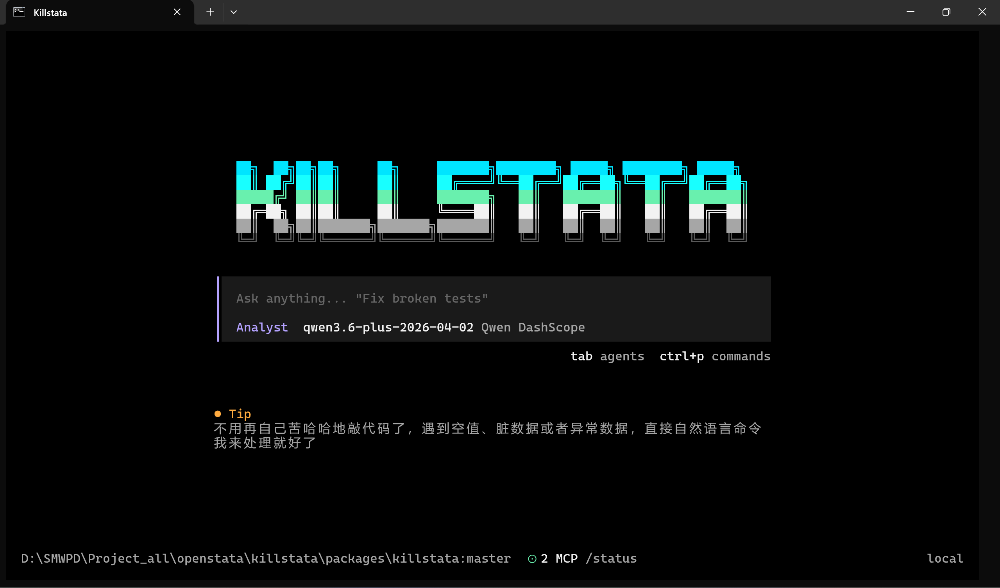
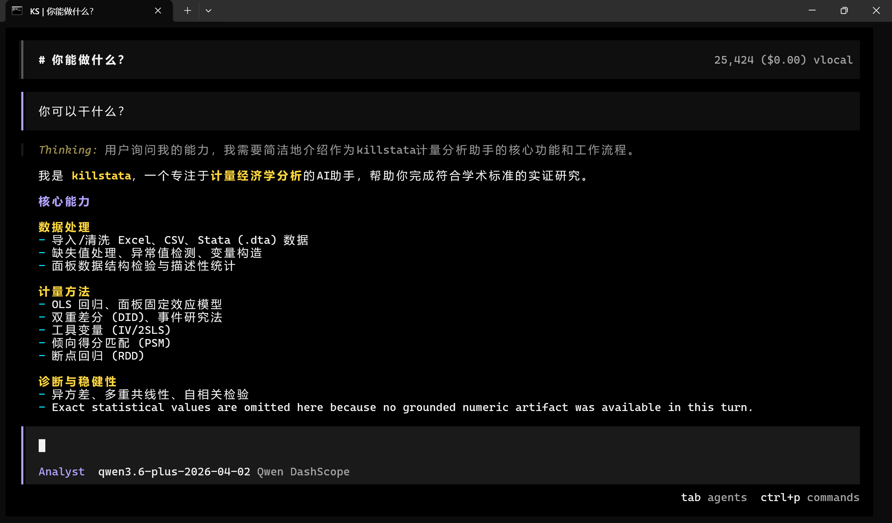

# KillStata

[](https://www.npmjs.com/package/killstata)
[](./LICENSE)
[](https://github.com/dean-create/KillStata/actions/workflows/typecheck.yml)


KillStata is an AI-native CLI for econometric research workflows.

It is built for people doing empirical research with panel data, policy evaluation, causal inference, and paper-ready reporting, but who do not want to glue together spreadsheets, Stata scripts, Python notebooks, regression exports, and result summaries by hand every single time.

This repository is the open-source CLI core. It focuses on reproducible data import, staged data processing, econometric estimation, and deliverable generation.

## Table of Contents

- [Why KillStata](#why-killstata)
- [Screenshots](#screenshots)
- [Core Features](#core-features)
- [Installation](#installation)
- [Common Commands](#common-commands)
- [Prompt Examples](#prompt-examples)
- [Artifacts Layout](#artifacts-layout)
- [Repository Structure](#repository-structure)
- [Development](#development)
- [FAQ](#faq)
- [Roadmap](#roadmap)
- [Contributing](#contributing)
- [Workflow Docs](#workflow-docs)
- [License](#license)

## Why KillStata

KillStata is not just a chat box and not just a regression wrapper.

It treats empirical analysis as a workflow:

1. Import raw data into a tracked dataset artifact.
2. Run QA and preprocessing as explicit stages.
3. Execute econometric methods against the current stage.
4. Save structured outputs that can be verified, exported, and reused.

In practice, KillStata is built for tasks like:

- "Import this Excel file and check whether the panel keys are duplicated."
- "Run a panel fixed-effects regression on the cleaned stage."
- "Generate a three-line table and a short interpretation."
- "Do not read the raw file again; continue from the current analysis artifact."

The core idea is simple:

- raw files are entry points
- artifacts are the working memory
- stages are the audit trail
- structured outputs are the source of truth

That design is what keeps the CLI usable when the analysis gets long, multi-step, and data-heavy.

## Screenshots

### Start Screen



### Capability View



## Core Features

### Data Workflow

- Import `CSV`, `XLSX`, and `DTA` files
- Convert raw input into a canonical internal working layer
- Preserve `datasetId` and `stageId` so each step stays traceable
- Run QA, filtering, preprocessing, and rollback as explicit stages

### Econometric Analysis

- OLS regression
- Panel fixed-effects regression
- DID-style workflows
- IV / 2SLS workflows
- PSM-related workflows
- Diagnostics, schema checks, and recommendation helpers

### Deliverables

- Regression outputs in structured JSON form
- Human-readable summaries
- Three-line tables for papers
- Export-friendly outputs such as Markdown, LaTeX, CSV, XLSX, and DOCX
- Analysis artifacts that can be reused instead of rerunning from raw files

## Installation

### Windows Users

```bash
npm i -g killstata@latest
```

This is the supported npm install path. Windows x64 users get the bundled native binary and can start the CLI without installing Bun first. npm installation on macOS and Linux is intentionally unsupported.

### Source Development

If you are working from source:

```bash
bun install
```

### Getting Started

Start KillStata:

```bash
killstata
```

On the first run, paste your DeepSeek API key. KillStata then prepares its private data-analysis environment automatically; no Python, Stata, MCP, skills, or directory configuration is required.

For source development only:

- Keep `bun` installed.

## Common Commands

```bash
killstata
killstata --version
killstata config
```

What they do:

- `killstata`: start the interactive CLI
- `killstata --version`: verify the installed version
- `killstata config`: optional advanced model settings, such as a custom OpenAI-compatible endpoint

## Prompt Examples

Once the CLI starts, useful prompts look like this:

- `Import this Excel file and show me the schema.`
- `Run QA on the current dataset and tell me if panel keys are duplicated.`
- `Use the current panel stage and run a fixed-effects regression with clustered SE.`
- `Export a three-line table and a short result summary.`
- `Continue from the current artifact instead of rereading the raw file.`

## Artifacts Layout

KillStata stores analysis outputs as tracked artifacts instead of treating the raw spreadsheet as permanent working memory.

Typical layout:

```text
.killstata/
  datasets/
    <datasetId>/
      manifest.json
      stages/
        stage_000_*.parquet
      inspection/
        stage_000_*.csv
        stage_000_*.xlsx
      meta/
        *_schema.json
        *_labels.json
      audit/
        *_summary.json
        *_log.md
      reports/
        main/
          results.json
          diagnostics.json
          numeric_snapshot.json
          three_line_table.tex
          three_line_table.docx
          delivery_result_summary.md
```

Why this matters:

- `manifest.json` records the source of truth
- `stages/` stores processing history
- `inspection/` stores user-readable table outputs
- `reports/` stores econometric results and paper-ready deliverables

## Repository Structure

This repository is a CLI-focused monorepo.

```text
packages/
  killstata/   main CLI package
  plugin/      plugin-related code
  script/      shared build and automation scripts
  sdk/js/      JavaScript SDK pieces
  util/        shared utilities
```

Main package:

- [packages/killstata](./packages/killstata)

## Development

Install dependencies:

```bash
bun install
```

Run typecheck:

```bash
bun run typecheck
```

Run CLI package tests:

```bash
bun run --cwd packages/killstata test
```

Build the CLI package:

```bash
bun run --cwd packages/killstata build
```

Build and inspect the Windows x64 npm release without publishing:

```bash
bun run --cwd packages/killstata release:npm --version 0.1.26 --dry-run
```

Publish a verified release from a clean, synchronized `main`/`master` branch:

```bash
bun run --cwd packages/killstata release:npm --version 0.1.26
```

What the release script does:

- requires an explicit version and builds every supported native package
- writes a SHA-512 release manifest and checks package dependency closure
- publishes native packages sequentially and the `killstata` launcher last
- resumes safely by skipping identical immutable versions
- verifies registry integrity and the final `latest` dist-tag

See [npm release architecture and runbook](./docs/npm-release.md) for authentication and recovery details.

## FAQ

### Do I need Stata installed?

No. KillStata is designed as its own CLI workflow layer. It can import common research data formats and run its own analysis pipeline without requiring a local Stata installation.

### Does it keep rereading the raw Excel file forever?

No. Raw files are only the entry point. After import, KillStata is designed to continue from structured artifacts and tracked stages rather than repeatedly treating the original spreadsheet as the source of truth.

### Which platforms does the npm package support?

The npm release supports Windows x64 only. It contains `killstata` and `killstata-windows-x64`; macOS and Linux npm installation is intentionally unsupported.

### Can it handle large datasets or many tables?

That is exactly why the project uses an artifact-first design. The goal is to avoid shoving raw tables into prompt context and instead continue from saved dataset stages, summaries, diagnostics, and result artifacts.

### What should I do if installation fails?

For Windows users, retry the recommended path first:

```bash
npm i -g killstata@latest
```

If the CLI still cannot find a native binary, reinstall the package and then check:

```bash
killstata --version
```

If data analysis cannot start, check the automatic analysis environment:

```bash
killstata config doctor
```

For source-mode development on unsupported platforms, install Bun:

- https://bun.sh

### Is this repository the desktop app?

No. This repository now focuses on the CLI core. If you are looking for a full desktop GUI experience, that is not the main target of this repo anymore.

## Roadmap

Near-term priorities:

- stabilize the Windows x64 npm distribution flow
- keep tightening the CLI-only repository structure
- improve UTF-8 and Chinese text handling across outputs
- make artifact-driven analysis paths more visible in the UX

Medium-term priorities:

- expand econometric workflow coverage
- improve structured result grounding and delivery quality
- strengthen regression-table and report-generation polish
- improve contributor onboarding and test clarity

## Contributing

Contributions are welcome.

Good contribution types:

- bug fixes
- workflow reliability improvements
- better error handling and user-facing messages
- documentation improvements
- test coverage for CLI and runtime behavior
- packaging and release improvements

Before opening a PR:

1. check whether an issue already exists
2. keep the PR focused
3. explain what changed and how you verified it

Start here:

- [CONTRIBUTING.md](./CONTRIBUTING.md)

## Architecture

For the lower-level data and runtime workflow, see the [analysis architecture](./docs/architecture.md).

## License

This project is licensed under the MIT License. See the LICENSE file for details.
